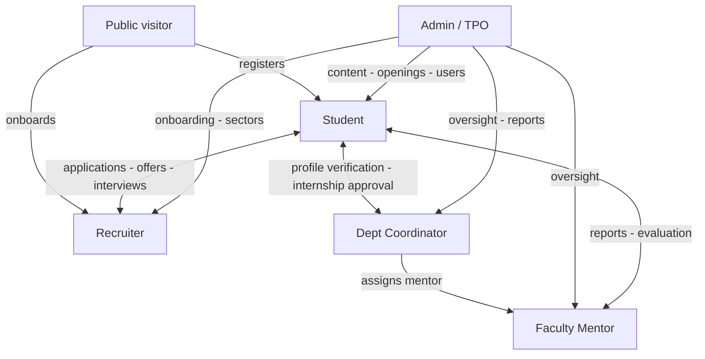
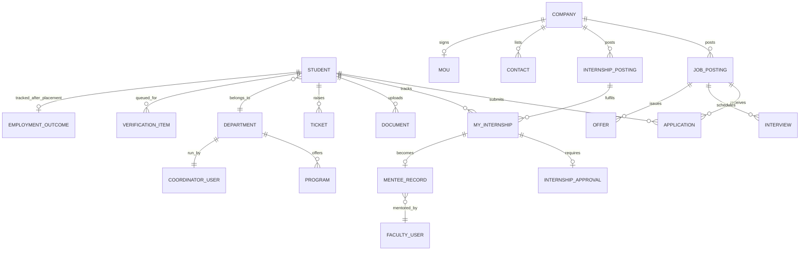
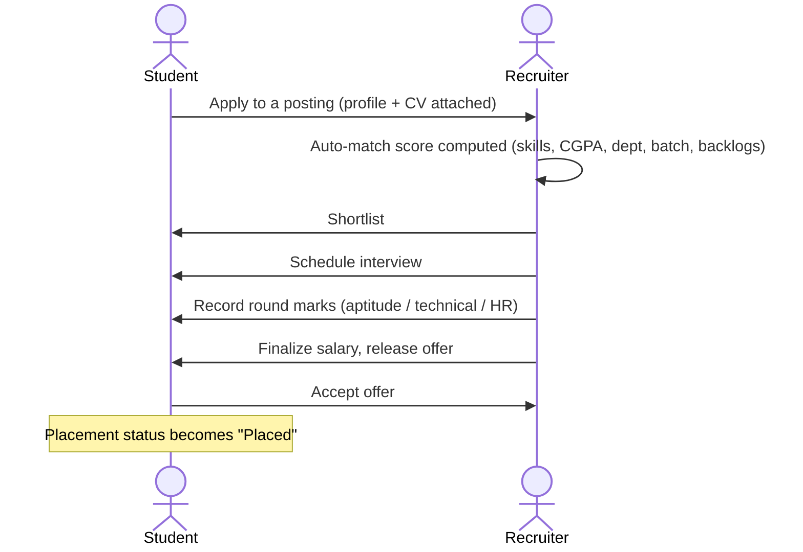
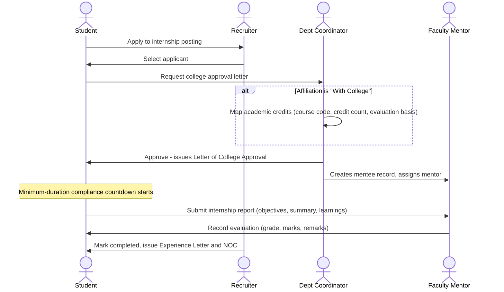
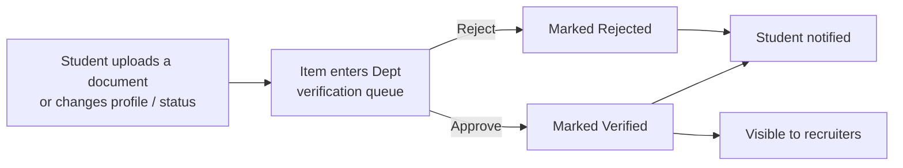
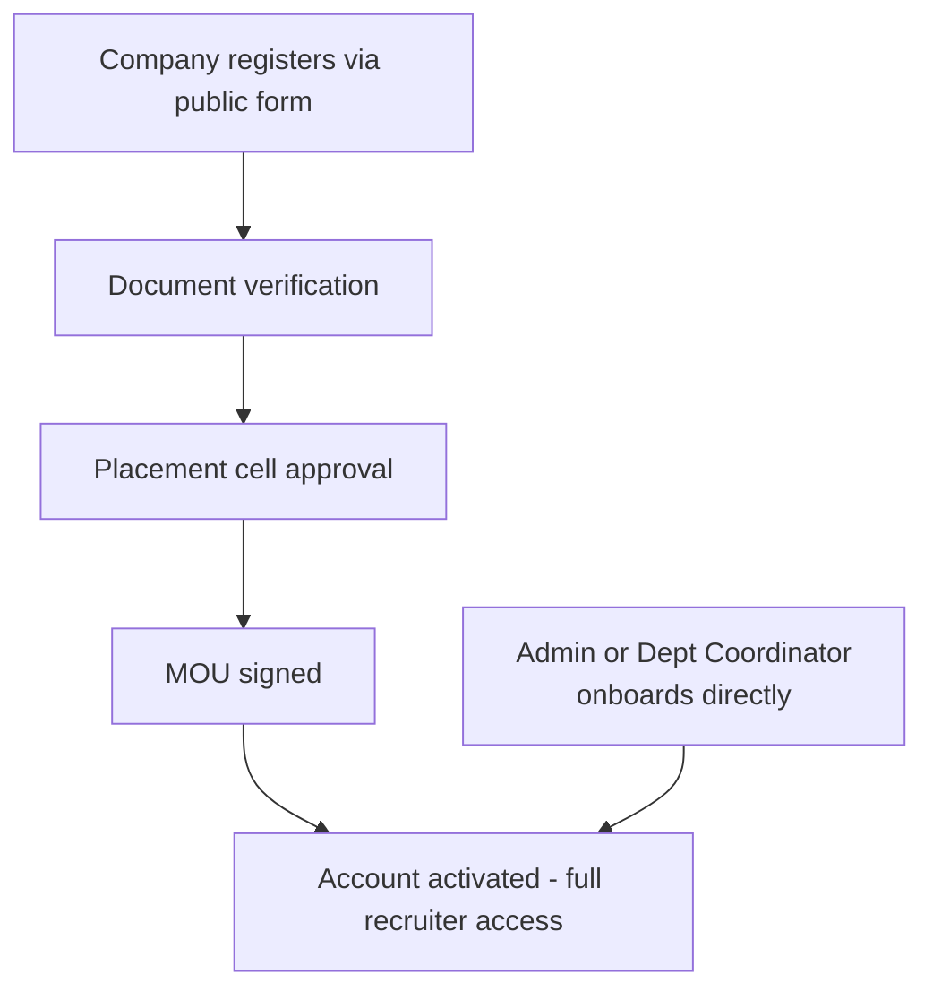
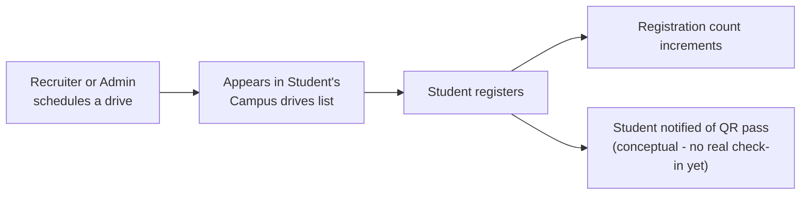
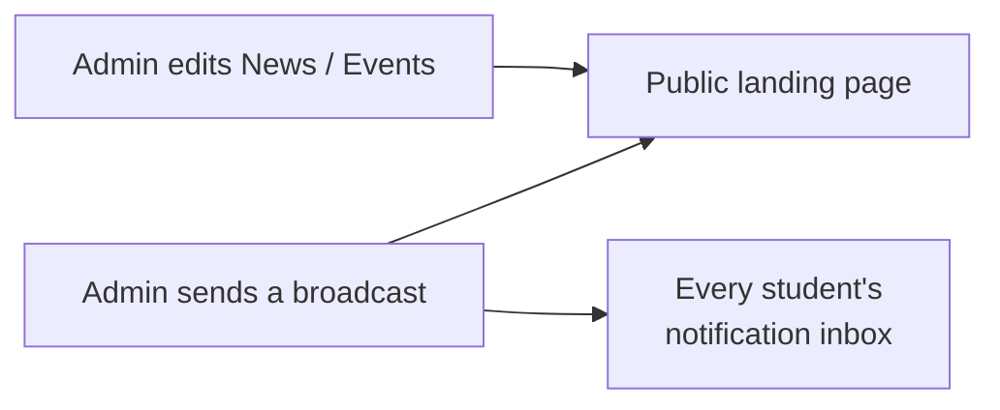
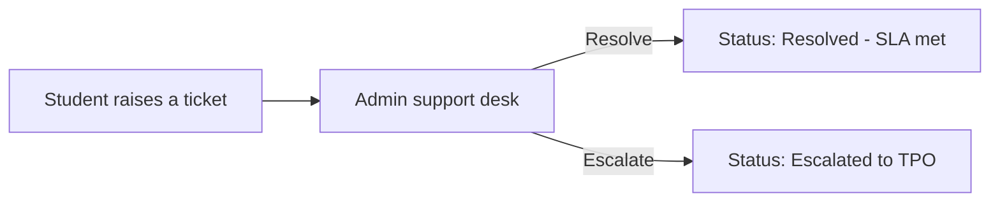

# Gujarat University Placement Portal — Complete System Flow

Reference document: every persona, every module, every cross-persona flow in the
current frontend. Written as groundwork for backend and database design — this
describes *behaviour*, not code. See the root `README.md` for the code-level
architecture (contexts, mock data layer, routing).

Persistence today: in-memory only, resets on reload. Auth today: none — the
persona switcher in the top bar is a view toggle, not a login. There is exactly
one of each persona (one student, one recruiter, one coordinator, one mentor);
multi-tenancy is a backend concern, not something the frontend had to solve.

## Contents

1. [System map](#system-map)
2. [Data model at a glance](#data-model-at-a-glance)
3. [Public website](#public-website)
4. [Student portal](#student-portal)
5. [Recruiter portal](#recruiter-portal)
6. [Department Coordinator portal](#department-coordinator-portal)
7. [Faculty Mentor portal](#faculty-mentor-portal)
8. [Admin / TPO portal](#admin--tpo-portal)
9. [Cross-persona journeys](#cross-persona-journeys)
10. [Shared systems](#shared-systems)
11. [Open questions for the backend](#open-questions-for-the-backend)

---

## System map

One public website and five portals. A portal is a persona, not an account —
switching personas in the top bar just swaps which console you're looking at.

| Persona | Who they represent | Modules | Can see other personas' data? |
|---|---|---|---|
| Public visitor | Anyone on the marketing site, not logged in | 1 page, many sections | Public info only |
| Student | Aarav Shah, Computer Science, batch 2022–26 | 13 | Own data only |
| Recruiter | TCS's campus hiring team | 12 | Candidates who applied to TCS roles |
| Dept Coordinator | Dr. R. Mehta, Computer Science & Applications | 8 | Students and companies scoped to their department |
| Faculty Mentor | Prof. Kavita Iyer, assigned internship mentor | 2 | Only mentees assigned to them |
| Admin / TPO | The university's central Placement Cell | 17 | Everything, university-wide |

---

## Data model at a glance

Core entities:

| Entity | Description |
|---|---|
| Student / Profile | Personal + academic record, skills, projects, preferences, completeness score |
| Application | One student's progress through one job posting: applied → shortlisted → interview → offer |
| Company | Name, sector, contacts, MOU, hiring history, visibility scope |
| Job Posting | Role, CTC, eligibility, rounds, skills required |
| Internship Posting | Paid/free, with-college/independent, minimum duration |
| My Internship | A student's own progress through one internship, stage by stage |
| Internship Approval | A pending request for the department to issue a college approval letter |
| Mentee Record | Created the moment an internship is approved; owned by Faculty |
| Interview | Candidate, round, date, panel, outcome |
| Offer | CTC, joining date, location, status |
| Drive | A scheduled recruiting event; students register into it |
| Department / Program | Academic structure; each department has a coordinator |
| Ticket / Survey | Support requests and feedback collection |
| Notification | A student's unified inbox item, written by many different actions |
| Verification Item | A profile change or document awaiting department sign-off |
| Employment Outcome | Post-placement status tracking (retention/attrition) |

### Three overlapping ideas of "a job"

The prototype (and this conversion, faithfully) keeps **three separate lists**
that all describe job openings, built at different times for different screens:

| Name today | Who owns it | Where it's used |
|---|---|---|
| `Jobs` | Nobody edits it — seed data | Public "now hiring" section, student's Browse Jobs |
| `RecJobs` | The recruiter | Recruiter's own Jobs & Postings, with per-candidate scoring |
| `Openings` | Admin | Admin's Job Openings approval queue |

Likewise, a candidate is represented twice: once inside a job posting's own
applicant list (used for the auto-match scoring on that specific posting), and
again as a separate flat evaluation list the recruiter marks up round by round.

**For the schema:** collapse these into one `job_posting` table (owned by a
company, with a status and a visibility scope) and one `application` table
(one row per student × posting) — the frontend needed three lists for
historical reasons, a real system shouldn't.

---

## Public website

No login, one long marketing page. Its job is to convert a visitor into
either a registered student or an onboarded recruiter.

| Section | What it shows | Where it leads |
|---|---|---|
| Hero & season ledger | Headline stat strip: placement rate, recruiters, highest package, offers made | Register / Onboard company |
| Placement officer | Who runs the cell, one contact | Email link |
| About | Mission, vision, best practices, leadership, one placement officer per department | — |
| Team | Placement cell staff directory | Email link |
| Gallery | Photo/video tabs of campus events | Opens a lightbox |
| News | Announcements — the same list Admin edits | — |
| Now hiring | Roles pulled from the shared job list | Register to apply |
| Upcoming drives | Non-completed drives | Register (via student portal) |
| What the platform does | Feature pitch | — |
| Partners | Logo wall, full-time + internship partners | — |
| Become a partner | Recruit full-time vs offer internships chooser | Recruiter onboarding form |
| Department grid | Placement % per department | — |
| Contact | Office address, email | — |

Two forms matter beyond this page: **Student registration** (name, enrolment
number, department, CGPA, university email, password) and **Recruiter
onboarding** (a three-way branch for Direct Employer / Recruitment Agency /
Individual Agent, each with different follow-up questions). Both currently
end in a toast + redirect — neither is wired to a real signup yet.

---

## Student portal

13 modules · Aarav Shah, Computer Science.

| Module | Purpose | Key actions |
|---|---|---|
| Dashboard | Landing view: active offer/interview banners, application counts, CV score, recommended jobs, notifications preview, profile completeness, training progress | Apply to a recommended job; jump to any module |
| My profile | Recruiter-facing bio in 7 tabs: Overview, Personal, Academics, Experience, Skills, Projects, Documents | Edit every field; add/edit/delete links, skills, tags, experience, projects, certifications, achievements, positions, documents, semester records; change placement status |
| Browse jobs | All postings, filterable by kind (Placement/Internship/OJT) and department tag | Apply — confirmation with CV attached |
| Companies | Every recruiter visible to this student (university-wide + own department) | View full company profile, open roles, follow |
| Campus drives | Scheduled hiring events | Register (once per drive) |
| Internships | Browse (paid/free/affiliation filters) and My internship (stage tracker) | Apply; request college approval; submit report; view generated letters |
| My applications | Every job application with a 4-stage progress bar | Withdraw, accept an offer, note a rejection |
| AI CV Studio | Weighted score out of 100 across 8 CV sections, live-adjustable sliders | Preview/generate a formatted CV as PDF; targeted improvement suggestions |
| Readiness index | Composite employability score vs. branch average | View trajectory chart and earned badges |
| Training | 5 tabs: My learning, Catalogue, Skill gap, Mock interviews, Practice & resources | Enrol in a course; book a mock interview slot |
| Notifications | Unified inbox for every system event that concerns this student | Mark all read; toggle channel preferences |
| Support & feedback | Ticket history plus open surveys | Raise a ticket; fill a survey |
| Alumni & network | 4 tabs: Directory & mentors, Referrals, Events, Success stories | Connect, request mentorship, request referral, register for event |

---

## Recruiter portal

12 modules · TCS campus hiring team.

| Module | Purpose | Key actions |
|---|---|---|
| Dashboard | Active postings, applicant totals, hiring funnel, upcoming interviews, posting list | Post a new job |
| Company profile | Public-facing record: about, hiring history, HR head, contacts | Edit profile; add/edit/remove contacts |
| Onboarding & verification | Read-only status of the 5-step onboarding checklist and verification documents | Jump to MOU |
| MOU | Signed memorandum's terms (hiring commitment, validity, signatory) | View as formatted document; create/renew (regenerates + opens signed copy) |
| Jobs & postings | List view + per-posting detail with auto-ranked, scored applicant table | New/edit/publish/close/delete a posting; review score breakdown; shortlist |
| Internships | Own internship postings and their applicants | New posting; select/reject applicant; mark completed & issue certificate |
| Candidates | Round-by-round evaluation board (aptitude/technical/HR marks), independent of the per-posting view | Record round marks pass/hold/fail; finalize salary & release offer; mark joined; reject |
| Interviews | Selection rounds configured per posting, plus scheduled-interview table | Schedule an interview; record a result |
| Offers | Every offer rolled out, with status | Roll out/edit an offer; view generated offer letter; revoke |
| Campus drives | This company's scheduled drives | Schedule a new drive |
| Calendar | Unified view of upcoming interviews + drives, same-day clash detection | Book an interview slot |
| Messages | Communication log with the Placement Cell | Compose a message |

The candidate-matching score is a deterministic weighted formula — skills
overlap (45%), CGPA above cutoff (25%), department fit (15%), batch match
(10%), no active backlogs (5%) — not a machine-learning model.

---

## Department Coordinator portal

8 modules · Dr. R. Mehta, Computer Science & Applications.

| Module | Purpose | Key actions |
|---|---|---|
| Dashboard | Department placement rate, pending-verification count, at-risk students (low readiness) | Jump to verification queue; schedule counselling |
| Verification queue | Every pending profile change, document upload, or status change from this department's students | Approve (unlocks for recruiters, notifies student) or reject |
| Internship approvals | Requests for a College Approval Letter | Approve — mapping academic credits first if "With College" — or reject |
| Companies & recruiters | University-wide directory (read-only) plus recruiters added just for this department | Onboard a department-only recruiter directly; request promotion to university-wide; remove |
| Students | Roster with CGPA, backlogs, computed readiness score, application count | Export roster; message the batch; view a student's CV |
| Applications | Every application from this department's students, with a 4-stage funnel | — |
| Drives | Drives this department's students are eligible for | — |
| Reports | 6 report types (placement summary, readiness, verification log, funnel, training, skill-demand) | Export as Excel or PDF |

---

## Faculty Mentor portal

2 modules · Prof. Kavita Iyer. The smallest console on purpose — a mentor
only ever needs to see the handful of students the department assigned to
them, and evaluate their internship reports.

| Module | Purpose | Key actions |
|---|---|---|
| Dashboard | Mentee counts by stage: report pending, ready to evaluate, evaluated | Jump to mentees ready for evaluation |
| My mentees | One row per assigned mentee — internship, duration, report status, evaluation | View a submitted report; record or edit a grade, marks, and remarks |

A mentee record doesn't exist until the department approves that student's
internship — see the [internship lifecycle](#internship-lifecycle) below for
exactly where it's created.

---

## Admin / TPO portal

17 modules · University-wide Placement Cell. The only console with no data-
visibility fence.

| Module | Purpose | Key actions |
|---|---|---|
| Overview | University-wide placement rate, trend chart, department breakdown, top recruiters | Generate report |
| Website content | 3 tabs: News, Events, Notifications — the same News list the public site reads | Add/edit/delete news & events; send a broadcast (also lands in every student's notification inbox) |
| Students | University-wide roster sample | Import from ERP (stub); export |
| Companies | Every company/agency/agent, any department scope | Onboard a recruiter directly; verify; promote department-only to university-wide |
| Job openings | A separate admin-managed openings queue distinct from recruiters' own postings | Generate from requests; new/edit; approve/publish/close/delete |
| Internships | University-wide aggregate: paid vs free, with-college vs independent | Read-only monitoring |
| Departments & programs | The department registry and academic program catalogue | Add/edit/delete departments and programs |
| Users & roles | Every account: students, coordinators, placement officers, recruiters | Add/edit/delete a user; approve a pending account |
| Sectors | Industry sector registry used to categorize companies/openings | Add/edit/delete |
| Campus drives | University-wide drive list | Schedule (stub) |
| Selection funnel | Applied → appeared → technical → HR → offer → joined, per company | Export report |
| Feedback & surveys | Every survey plus a closed-loop actions list (what was fixed because of feedback) | Create/close/delete a survey |
| Support desk | Every ticket, university-wide, with SLA tracking | Resolve or escalate |
| Reports | 6 accreditation-oriented report types (placement summary, NAAC/NIRF, recruiter engagement, drive outcomes, training impact, skill-gap) | Excel export or PDF preview |
| Data integrity | A live self-test of 9 cross-entity relationships (see below) | Re-run checks |
| Employment outcomes | Post-placement status tracking (active/promoted/left/higher studies) feeding retention rate | Send check-in survey; record a status update |
| Settings | Placement policy (offer cap, minimum CGPA, academic year) and ERP integration status | Save |

---

## Cross-persona journeys

### Placement lifecycle

A student and a recruiter, moving one application from "applied" to "placed."

A rejection can happen at any round instead of advancing. Withdrawing is
always available to the student up until an offer exists. Accepting an offer
is the one action in the whole system that writes to the student's own
placement status from outside the student portal.

### Internship lifecycle

The longest chain in the system — it passes through all four non-admin
personas in order.

1. Student applies from the Browse tab; this adds them to the posting's own applicant list.
2. Recruiter selects them from that same list — the student's own tracker advances automatically.
3. Student requests approval; this creates a pending request the department can see.
4. Department approves. If the internship is university-credited ("With College"), approving first asks for the course code, credit count, and evaluation basis. Approving always assigns Prof. Kavita Iyer as mentor and starts the minimum-duration clock.
5. The moment it's approved, a mentee record appears in the Faculty portal — it didn't exist before this.
6. Student works the internship, then submits a report once eligible.
7. Faculty grades it.
8. Recruiter (or department) marks it complete, which is blocked until both the report exists and the minimum-weeks compliance window has elapsed.

> **Known narrowing:** every one of these steps currently only fully connects
> the student, recruiter, and department records when the student is Aarav
> Shah specifically (the app's one hardcoded "current user"). With real
> accounts, each step needs to resolve "which student" from the logged-in
> session instead of a hardcoded enrolment number.

### Profile verification

Anything a student adds to their profile that a recruiter should trust — a
document, a status change — goes through the department first.

### Recruiter onboarding

Two paths in: the slow one (public form, verified by the cell) and the fast
one (Admin or a Department Coordinator vouches for a company they already
know and grants access immediately).

A directly onboarded company can be scoped university-wide (Admin) or to one
department only (Dept Coordinator) — and a department-only company can later
request promotion to university-wide visibility.

### Campus drive registration

### Content → public sync

Admin's "Website content" module isn't a separate content store — it edits
the exact same news list the public homepage reads, so a published item
shows up immediately.

### Support ticket

Tickets and their SLA countdowns are visible to both the student who raised
them (their own list) and Admin (every ticket, university-wide) — the same
record, two different filtered views.

### Data-integrity self-check

Admin has a page that does nothing but ask the current in-memory data
whether it still makes sense — a preview of the kind of constraint a real
database would enforce automatically.

| Check | What it would be, as a database constraint |
|---|---|
| Company visibility scopes resolve | FK: `company.department_id` must exist, or be null for university-wide |
| Company references resolve | FK from every job/internship/drive to `company.id` |
| Internship tracker links resolve | FK from a student's tracked internship to `internship_posting.id` |
| Internship stage sync | Invariant: a student's own stage should match their entry in the posting's applicant list |
| Candidate stage matches offers | Invariant: a candidate with an offer record should be in the "Offer" stage |
| Offer/interview names resolve | FK to the candidate/application record |
| Programs link to real departments | FK: `program.department_id` |
| Verification queues reference real students | FK: `verification_item.student_id`, `internship_approval.student_id` |
| Recruiter accounts link to real companies | FK: `user.company_id` where role = Recruiter |

All 9 currently pass — a good starting point for turning each row above into
an actual foreign-key constraint.

---

## Shared systems

### Notifications

One inbox per student, written to by many unrelated actions across the whole
system:

| Triggered by | Who | Message student sees |
|---|---|---|
| Registering for a drive | Student's own action | Registration + QR pass reminder |
| Profile item approved | Dept Coordinator | "Your &lt;item&gt; was verified" |
| Salary finalized / offer released | Recruiter | Offer amount + where to respond |
| Internship approved | Dept Coordinator | Approval letter issued, may now join |
| Internship completed | Recruiter | Experience Letter & NOC issued |
| Faculty evaluation recorded | Faculty Mentor | Grade + marks |
| Broadcast sent | Admin | The broadcast message itself |

Each student also controls channel preferences (email / SMS / in-app /
WhatsApp) — offers and interview schedules are always treated as sent
regardless of preference.

### Documents & exports

Every generated document is composed from live data at the moment it's
opened, then rendered to PDF client-side — there's no document storage, only
document *generation*.

| Document | Generated from | Who can open it |
|---|---|---|
| Curriculum Vitae | Student profile | Student; reviewing recruiter; department coordinator |
| Letter of College Approval | Internship + student + credits (if any) | Student; department |
| Experience Letter & NOC | Completed internship | Student |
| Internship Completion Report | Student's submitted report | Student; Faculty Mentor |
| Memorandum of Understanding | Recruiter's company + MOU terms | Recruiter |
| Offer Letter | A specific offer record | Recruiter |
| Reports (Dept + Admin) | Whatever dataset the report covers | Dept Coordinator; Admin |

Reports additionally export to a real `.xlsx` file (not just a PDF preview)
with the underlying rows, pulled live from whichever list is authoritative at
export time.

### Placement assistant (chat)

A floating assistant, visible only inside the student portal, that answers a
fixed set of question types by reading the same student's own live data:

| Asks about | Answers with |
|---|---|
| Application status | Every application and its current outcome |
| Eligibility / CGPA | Whether their CGPA clears current postings' cutoffs |
| Interview schedule | Next confirmed interview |
| Mock interviews | Points to Training, offers to open it directly |
| CV / resume | Current CV score, offers to open CV Studio |
| Offers | Any pending offer and the response deadline |
| Drives | Upcoming drives |
| Support / issues | Points to Support, can open the raise-a-ticket form directly |
| Readiness / employability | Current readiness score vs. branch average |

---

## Open questions for the backend

Not defects — deliberate gaps that make sense for a single-user frontend
prototype and need a real answer once there's a database behind it.

- **Authentication & multi-tenancy.** There is currently one student, one
  recruiter (TCS), one coordinator, one mentor. Every "current user"
  reference needs to become "whoever is logged in."
- **Three job lists, one entity.** Public `Jobs`, the recruiter's own
  `RecJobs`, and Admin's `Openings` should converge on one `job_posting`
  table with a status and an owning company, rather than three lists kept in
  sync by hand.
- **Two candidate views, one entity.** A posting's own scored applicant list
  and the recruiter's separate flat evaluation board describe the same
  underlying thing — one candidate's progress through one posting.
- **Persistence.** Every mutation today lives in React state and is lost on
  refresh. Nothing about the flows above changes once each becomes a real
  write to a database — they're the transactions the schema needs to
  support.
- **Notifications as a side effect.** A dozen unrelated actions all write to
  the same student inbox; a real system likely wants this as an
  event/outbox pattern rather than each action reaching directly into
  another table.
- **Document generation stays client-side-able.** Since every document is
  composed from data at open-time, the backend mainly needs to serve the
  underlying records — rendering can stay in the frontend, or move
  server-side later for emailing signed copies.
